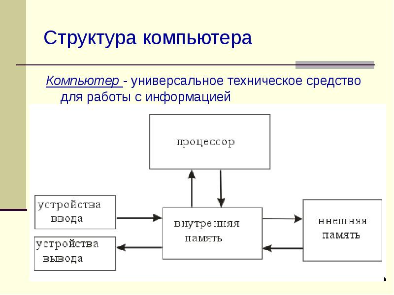
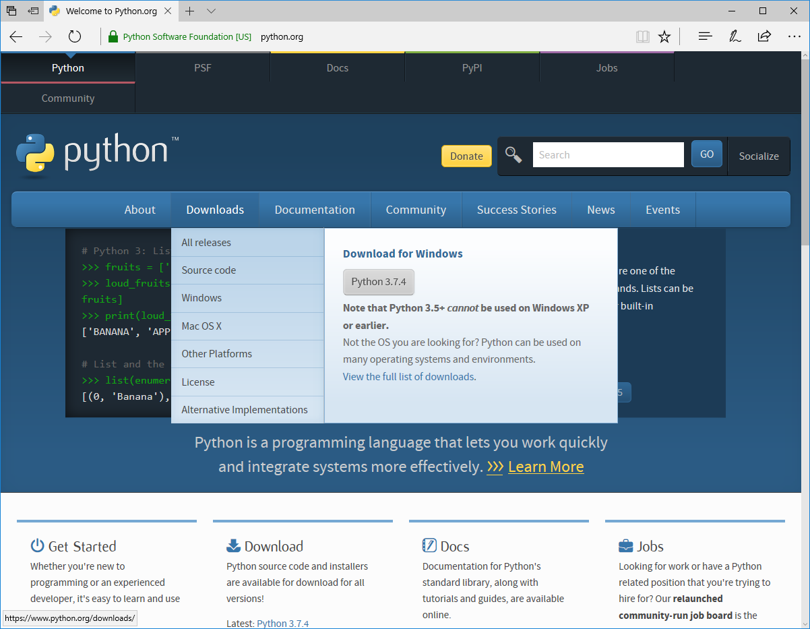
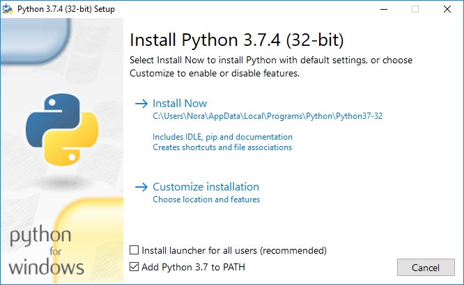
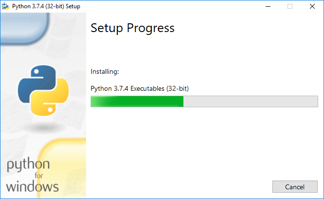
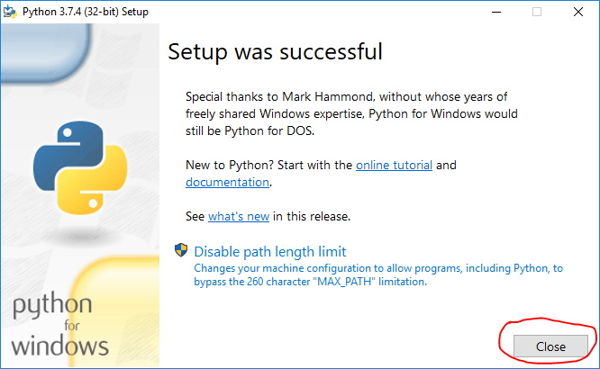

# Введение в Python

## 1. Общая информация о курсе

Доброго времени суток!

Меня зовут Олег, я преподаватель курса программирования на языке Python.

### План курса

Курс состоит из 16 уроков.

* С 1 по 4 урок мы будем изучать сам язык Python, его основы, синтаксис и будем писать простейшие
логические программы.
* С 5 по 14 урок мы будем изучать те технологии, которые можно использовать с помощью языка Python и
будем учиться это делать.
* С 15 по 16 урок будут отведены на более глубокое изучение одной из технологий и на выполнение
выпускной работы.

### Как будут проходить уроки

1. Расписание занятий.
2. Количество занятий.
3. Перерывы на занятиях.
4. Опоздания
5. Самостоятельные работы.
6. Папка курса на общем диске.
7. Чат в Вконтакте.
8. Домашние задания (большие и маленькие).
9. Дополнительная литература, которую нужно читать дома.

* Марк Лутц - Изучаем Python
* Swaroop Chitlur - Укус Питона
* Бхаргава Адитья - Грокаем алгоритмы

### Необходимые начальные знания для прохождения курса

1. Умение работать с компьютером
2. Отсутствие страха перед английским языком
3. Скорость печати

### Что нужно иметь дома/с собой

1. Дома обязательно нужно установить PyCharm (либо любую другую IDE/редактор кода)
2. С собой на уроках иметь тетрадь и ручку, по желанию можно приносить свой ноутбук.

### Знакомство с учениками

Каждый ученик должен:

1. Представиться.
2. Рассказать, почему решил изучать именно Python.
3. Опыт работы с компьютером, знание других языков программирования, знание математики.

## 2. Что такое Python

### Сферы применения Python

В порядке востребованности, обширности и значения:

1. WEB (Django, Flask, aiohttp)
2. Data mining/нейросети (SciPy, NumPy)
3. Тестирование (PyTest)
4. Автоматизация (скрипты)
5. Системные утилиты
6. Desktop-приложения (PyQT)
7. Мобильные приложения (Kivy)

### Где используется Python

* Компания Google использует Python в своей поисковой системе.
* Такие компании, как Intel, Cisco, Hewlett-Packard, Seagate, Qualcomm и IBM, используют Python для
тестирования аппаратного обеспечения.
* Служба коллективного использования видеоматериалов YouTube в значительной степени реализована на
Python.
* Агенство национальной безопасности США использует Python для шифрования и анализа разведданных.
* Компании JPMorgan Chase, UBS, Getco и Citadel применяют Python для прогнозирования финансового
рынка.
* Популярная программа BitTorrent для обмена файлами в пиринговых сетях написана на языке Python.
* Популярный веб-фреймворк App Engine от компании Google использует Python в качестве прикладного
языка программирования.
* NASA, Los Alamos, JPL и Fermilab используют Python для научных вычислений.

### Формальные языки

Любой формальный язык, в том числе и Python, имеет три самые важные составляющие:

* Операторы
* Данные
* Конструкции

Также в языках программирования часто присутствуют комментарии

Рассмотрим как пример один из самых известных формальных языков

```math
5 * 3 / (1 + 2)
```

В данном случае операторами являются

* Оператор умножения
* Оператор деления
* Оператор сложения
* Операторы группировки (скобочки)

Данными являются

* Число 5
* Число 3
* Число 1
* Число 2

### Структура компьютера

Перед тем, как работать с языком, стоит изучить тот объект, которому мы будем передавать команды.

Состав компьютера

1. Процессор - электронный блок, либо интегральная схема (микропроцессор), исполняющая машинные
инструкции (код программ), главная часть аппаратного обеспечения компьютера или программируемого
логического контроллера. Иногда называют микропроцессором или просто процессором.
2. Оперативная память - энергозависимая часть системы компьютерной памяти, в которой во время
работы компьютера хранится выполняемый машинный код (программы), а также входные, выходные и
промежуточные данные, обрабатываемые процессором.
3. Жёсткий диск - энергонезависимая память, используется для хранения массива неизменяемых данных.
4. Устройства ввода-вывода и прочая перифирия.



### Что такое программа

Программа - это заданная последовательность действий. В компьютере программой является любой
последовательный набор байт, который может интерпретироваться компьютером как команды.

Обычно программы хранятся на жёстком диске. После запуска программы на компьютере её код (
последовательность байт) копируется в оперативную память и команда за командой передаётся в
процессор для выполнения. Также в оперативной памяти выделяется определённый объём для хранения
дополнительной информации, которая потребуется при работе программы.

После завершения программы её код и информация, которая требовалась для выполнения программы
удаляются из оперативной памяти.

### Что такое переменная

### История языка Python

Язык программирования Python начал свою историю ещё в 1980-х годах, когда идеей о его создании
загорелся Гвидо ван Россум - нидерландский программист. В декабре 1989 года он приступил к написанию
языка Python в центре математики и информатики в Нидерландах. В среде разработчиков Python он также
известен как "великодушный пожизненный диктатор", что означает, что он продолжает наблюдать за
процессом разработки Python, принимая окончательные решения, когда это необходимо. Но в 2018 году
он решил оставить пост "диктатора" и стать обычным разработчиком.

### Особенности языка программирования Python

#### Понятие переменной

Когда программа запускается, в оперативной памяти компьютера выделяется область памяти, отведённая
для хранения дополнительной информации, которая понадобится во время работы программы.

На языке Python доступ к такой информации и управление ею происходит через переменные. Значение
слова "переменная" в нашем случае имеет такой же функционал, как и в математике. В работе программы
в переменной в зависимости от условий могут хранится абсолютно любые данные, которыми можно
оперировать.

Переменную в Python можно ассоциировать как со стикером, который мы приклеиваем к документам, а
данные - с самими документами. Внутри оперативной памяти у нас хранятся данные, и переменные
указывают на то, где эти данные находятся. На одни и те же данные может указывать несколько
переменных, но одна переменная может вести только к одному набору данных. Если на данных не осталось
ни одного стикера, то есть к ним не ведёт ни одна переменная - то данные удаляются из памяти.

#### Интерпретируемость

Языки программирования в общем подходе делятся на два класса — компилируемые и интерпретируемые.
Стоит отметить, что эта классификация языков программирования на компилируемые и интерпретируемые,
является весьма условной, поскольку для любого языка программирования может быть создан как
компилятор, так и интерпретатор. Кроме того бывают языки программирования смешанного типа.

Программа на компилируемом языке при помощи специальной программы компилятора преобразуется
(компилируется) в набор инструкций для данного типа процессора (машинный код) и далее записывается в
исполняемый файл, который может быть запущен на выполнение как отдельная программа. Другими словами,
компилятор переводит программу с языка высокого уровня на низкоуровневый язык, понятный процессору
сразу и целиком, создавая при этом отдельную программу.

Если программа написана на интерпретируемом языке, то интерпретатор непосредственно выполняет
(интерпретирует) ее текст без предварительного перевода. При этом программа остается на исходном
языке и не может быть запущена без интерпретатора. Можно сказать, что процессор компьютера — это
интерпретатор машинного кода. Кратко говоря, интерпретатор переводит на машинный язык прямо во время
исполнения программы.

#### Динамическая типизация

Приём, широко используемый в языках программирования и языках спецификации, при котором переменная
связывается с типом в момент приваивания значения, а не в момент объявления переменной. Таким
образом, в различных участках программы одна и та же переменная может принимать значения разных
типов.

#### Мультипарадигменность

Парадигма - это совокупность идей и понятий, определяющих стиль написания компьютерных программ
(подход к программированию). Это способ концептуализации, определяющий организацию вычислений и
структурирование работы, выполняемой компьютером.

#### Философия

* Красивое лучше, чем уродливое.
* Явное лучше, чем неявное.
* Простое лучше, чем сложное.
* Сложное лучше, чем запутанное.
* Плоское лучше, чем вложенное.
* Разреженное лучше, чем плотное.
* Читаемость имеет значение.
* Особые случаи не настолько особые, чтобы нарушать правила.
* При этом практичность важнее безупречности.
* Ошибки никогда не должны замалчиваться.
* Если не замалчиваются явно.
* Встретив двусмысленность, отбрось искушение угадать.
* Должен существовать один — и, желательно, только один — очевидный способ сделать это.
* Хотя он поначалу может быть и не очевиден, если вы не голландец.
* Сейчас лучше, чем никогда.
* Хотя никогда зачастую лучше, чем прямо сейчас.
* Если реализацию сложно объяснить — идея плоха.
* Если реализацию легко объяснить — идея, возможно, хороша.
* Пространства имён — отличная вещь! Давайте будем делать их больше!

Версии Python

* Python 2
* Python 3

## 3. Установка Python

Установить интерпретатор Python можно несколькими способами - собрать интепретатор Python вручную из
исходных кодов либо скачать с официального сайта или репозиториев. Первый способ для нас слишком
сложен и долог, поэтому пойдём более простым путём.

### Для Windows

Скачать установочник интерпретатора Python для Windows (как и исходные коды) можно с
[официального сайта](https://www.python.org/). Скачиваете и производите установку. Ниже расписаны
все шаги для установки интерпретатора

* Скачивание



* Выбор опций



* Процесс установки



* Завершение установки



### Linux

К сожалению, найти установочника Python для Linux не удаётся, поэтому остаётся вариант либо
собирать из исходного кода, либо устанавливать из репозитория. Обычно в официальных репозиториях
дистрибутивов нет самых новых версий Python. Например, последняя версия в официальном дистрибутиве
на моей Linux Mint 19 в данный момент 3.6.8, когда на [официальном сайте](https://python.org)
последняя версия 3.7.4.

Чтобы установить из репозитория по умолчанию на Debian дистрибутивах нужно ввести команду

```shell
sudo apt install python3
```

Также для Debian дистрибутивов есть репозиторий с последними версиями Python, но могут быть проблемы
с добавлением репозитория в систему

```shell
sudo add-apt-repository ppa:deadsnakes/ppa
sudo apt update
sudo apt install python3
```

* Mac OS

Не знаю

## 4. Режимы интерпретатора

Интерпретатор может работать в двух режимах - интерактивном и обычном. Чтобы запустить
интерепритатор в интерактивном режиме, достаточно просто в терминале/консоли ввести команду
`python` или `python3`, может быть даже `python3.7`, в зависимости от вашей системы и способа
установки, а также от существования на компьютере ранее установленных версий.

В обычном режиме интерпретатору указывается файл с кодом Python, который он выполняет. Файл можно
указать через аргумент запуска интерпретатора, например `python3 myfolder/images/main.py`.

## 5. Первая программа

### Hello, world! в интерактивном интерпретаторе

Запустите интерактивный интерпретатор. Перед вами появится строка приглашения интерактивного
интерпретатора. Здесь вы можете писать код строчка за строчкой и видеть результат его выполнения.
Напишите строку `print("Hello, world!")` и посмотрите результат. Следующей строкой напишите
`46 / 23` и тоже посмотрите результат

### Hello, world! в модуле

Конечно же, писать реальный программный код в интерактивном интерпретаторе очень неудобно. Поэтому
попробуем написать код в обычном текстовом файле. Давайте создадим файл `main.py` с помощью любого
текстового редактора и напишем в нём то, что писали в интерактивном интерпретаторе

```python
print("Hello, world!")
print(46 / 23)
```

Чтобы выполнить эту программу, нужно запустить интерпретатор и первым аргументом передать ему путь к
файлу с кодом. Если вы в консоли перешли в директорию с этим файлом, то запустить его можно командой
`python3 main.py`

### Переменные

#### Правила создания переменных

Есть определённые правила того, как можно и как нельзя называть переменные.

* Переменные могут состоять из любых буквенных символов, цифр и знака нижнего подчёркивания
* Имя переменной не может начинаться с цифры

Можно:

```python
a = 20
_b = 30
а1вада2_кедавра3 = 180
```

Нельзя:

```python
123ab = 123
ab!cd = 56
```

#### Пример работы с переменными

Ниже приведённая программа на языке Python считывает с консоли два числа и выводит на экран их сумму

```python
a = int(input())
b = int(input())
print(a + b)
```

#### Удаление переменных

Переменные можно удалять

```python
a = 5
del a
print(a)  # Ошибка
```

### Простые типы данных

Простые типы данных (перечислить на доске и не стирать):

1. Целые числа (int)
2. Числа с плаващей запятой (float)
3. Комплексные числа (complex)
4. Строки (str)
5. Логический (bool)
6. NoneType

### Операции с числами

Операторы в Python для работы с числами (перечислить на доске и не стирать):

1. "+" (сложение)
2. "-" (вычитание)
3. "*" (умножение)
4. "/" (деление)
5. "//" (целочисленное деление)
6. "%" (деление с остатком)
7. "**" возведение в степень

## 6. Самостоятельная работа

Написать программу, которая считывает два числа и выводит их сумму, разность, частное, произведение,
результат целочисленного деления, результат деления с остатком, результат возведения с остатком

## 7. Синтаксис

* Конец строки является концом инструкции (точка с запятой не требуется).

* Вложенные инструкции объединяются в блоки по величине отступов. Отступ может быть любым,
главное, чтобы в пределах одного вложенного блока отступ был одинаков. И про читаемость кода не
забывайте. Отступ в 1 пробел, к примеру, не лучшее решение. Используйте 4 пробела (или знак
табуляции, на худой конец).

* Вложенные инструкции в Python записываются в соответствии с одним и тем же шаблоном, когда
основная инструкция завершается двоеточием, вслед за которым располагается вложенный блок кода,
обычно с отступом под строкой основной инструкции.

```text
Основная инструкция:
    Вложенный блок инструкций
```

* Несколько специальных случаев

* * Иногда возможно записать несколько инструкций в одной строке, разделяя их точкой с запятой:

```python
a = 1; b = 2; print(a, b)
```

Но не делайте это слишком часто! Помните об удобочитаемости. А лучше вообще так не делайте.

* * Допустимо записывать одну инструкцию в нескольких строках. Достаточно ее заключить в пару
круглых, квадратных или фигурных скобок:

```python
if (a == 1 and b == 2 and
    c == 3 and d == 4):  # Не забываем про двоеточие
        print('spam' * 3)
```

* * Тело составной инструкции может располагаться в той же строке, что и тело основной, если тело
составной инструкции не содержит составных инструкций. Пример:

```python
if x > y: print(x)
```

## 8. Условные операторы

### Конструкция if [elif] [else]

```python
if <условие 1>:
    <какой-то код 1>
elif <условие 2>:       # Необязательно
    <какой-то код 2>
elif <условие 3>:       # Необязательно
    <какой-то код 3>
else:                   # Необязательно
    <какой-то код 4>
```

Пример:

```python
number = int(input())
if number == 1:
    print("It is 1")
elif number == 2:
    print("It is 2")
else:
    print("I don't know this")
```

### if внутри if

Пример:

```python
number = int(input())
if number >= 1:
    print("It is more or equal than 1")
    if number == 3:
        print("It is 3")
```

### Операторы сравнения

Операторы сравнения чисел (перечислить на доске и не стирать):

1. "==" (равно)
2. ">=" (больше или равно)
3. "<=" (меньше или равно)
4. "!=" (не равно)
5. "<" (меньше)
6. ">" (больше)

### Операторы условий

1. Привести пример выполнения одного кода при нескольких условиях
2. Рассказать об операторах условий

* and
* or
* not
* in
* not in
* is
* is not

### Однострочный условный оператор

Пример:

```python
a = int(input())
print("YES" if a == 5 else "NO")
```

## 9. Самостоятельная работа

С консоли вводится день рождения человека в виде трёх чисел: день, месяц и год рождения - каждое на
отдельной строке. Вычислить количество полных лет на основе сегодняшней даты. Использовать модуль
datetime запрещается. Сегодняшнюю датой можно выбрать любую дату.

## 10. Домашняя работа

* Написать программу:
Дано пять чисел, каждое число вводится в консоли в отдельной строке. Вывести на экран наименьшее из
них
* Зарегистрироваться на <https://informatics.msk.ru>
* Прочесть Марк Лутц - Главы 1-6, 10-12
* Прочесть Укус Питона - Главы 1-8
