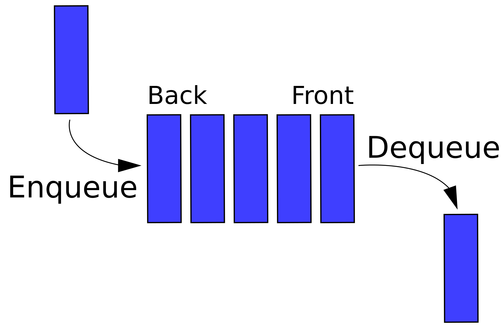
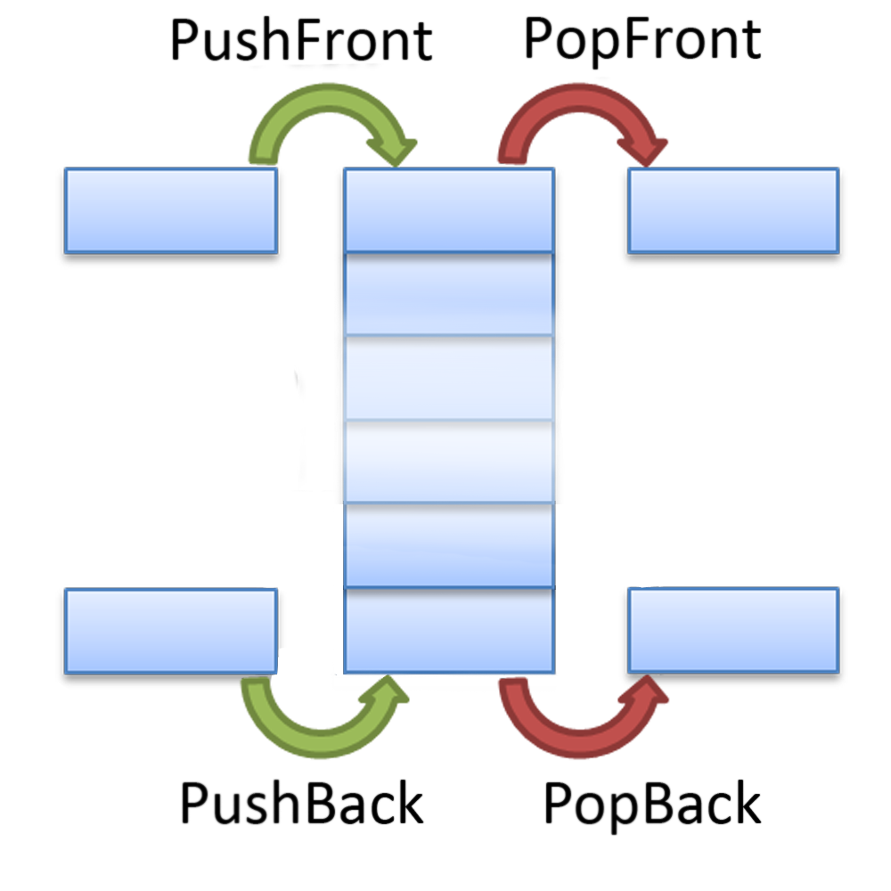
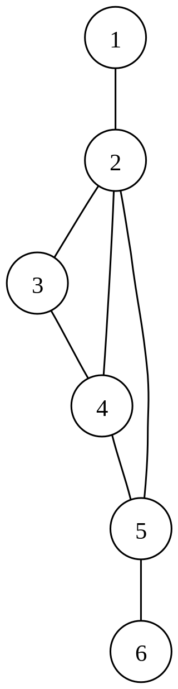

# Коллекции, графы и деревья

## 1. Понятие стека

Стек (англ. stack — стопка; читается стэк) — абстрактный тип данных, представляющий собой список
элементов, организованных по принципу LIFO (англ. last in — first out, «последним пришёл — первым
вышел»).

## 2. Понятие очереди

Очередь — абстрактный тип данных с дисциплиной доступа к элементам «первый пришёл — первый вышел»
(FIFO, англ. first in, first out). Добавление элемента (принято обозначать словом enqueue —
поставить в очередь) возможно лишь в конец очереди, выборка — только из начала очереди (что принято
называть словом dequeue — убрать из очереди), при этом выбранный элемент из очереди удаляется.

## 3. Понятие дек

Дек (от англ. deque — double ended queue) — структура данных, представляющая из себя список
элементов, в которой добавление новых элементов и удаление существующих производится с обоих концов.
Эта структура поддерживает как FIFO, так и LIFO, поэтому на ней можно реализовать как стек, так и
очередь. В первом случае нужно использовать только методы головы или хвоста, во втором — методы push
и pop двух разных концов. Дек можно воспринимать как двустороннюю очередь.

## 4. Самостоятельная работа

На <http://informatics.msk.ru>:

* № 54 (<https://informatics.msk.ru/mod/statements/view.php?id=207>)
* № 57 (<https://informatics.msk.ru/mod/statements/view3.php?id=207&chapterid=57>)
* № 60 (<https://informatics.msk.ru/mod/statements/view3.php?id=207&chapterid=60>)

## 5. Понятие графа

Граф — абстрактный математический объект, представляющий собой множество вершин графа и набор рёбер,
то есть соединений между парами вершин. Например, за множество вершин можно взять множество
аэропортов, обслуживаемых некоторой авиакомпанией, а за множество рёбер взять регулярные рейсы этой
авиакомпании между городами.

Самый простой пример использования графов - это географические карты. Поиск определённого пути на
карте решается с помощью графов.

## 6. Обход графа в глубину

## 7. Обход графа в ширину

## 8. Алгоритм Дейкстры

## 9. Домашнее задание

Обязательно:

* №160 (<https://informatics.msk.ru/mod/statements/view3.php?id=255&chapterid=160>)
* №460 (<https://informatics.msk.ru/mod/statements/view3.php?id=359&chapterid=460>)
* №111540 (<https://informatics.msk.ru/mod/statements/view3.php?id=256&chapterid=111540>)
