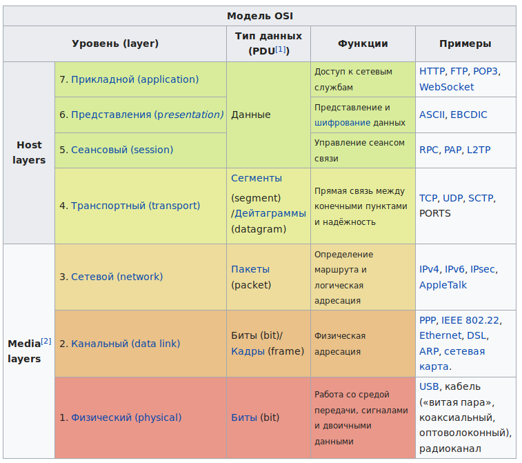

# Основы работы с сетью

## 1. История интернета

История Интернета началась с разработки компьютеров в 1950-х годах и появления научных и прикладных
концепций глобальных вычислительных сетей почти одновременно в разных странах, в первую очередь в
научных и военных лабораториях в США, Великобритании и Франции.

Принципы, по которым строится Интернет, впервые были применены в сети ARPANET, созданной в 1969 году
по заказу американского агентства DARPA. Используя наработки ARPANET, в 1984 году Национальный
научный фонд США создал сеть NSFNET для связи между университетами и вычислительными центрами. В
отличие от закрытой ARPANET подключение к NSFNET было достаточно свободным и к 1992 году к ней
подключились более 7500 мелких сетей, включая 2500 за пределами США. С передачей опорной сети NSFNET
в коммерческое использование появился современный Интернет.

Первоначально, как и в случае с предыдущими сетями, система, которая впоследствии должна была
превратиться в Интернет, главным образом предназначалась для использования правительством и
государственными органами.

Тем не менее, интерес к коммерческому использованию Интернета вскоре стал широко обсуждаемой темой.
Хотя коммерческое использование было запрещено, точное определение коммерческого использования было
неясным и субъективным. UUCPNet и X.25 IPSS не имели таких ограничений, что в конечном итоге привело
к официальному запрету на использование UUCPNet при соединениях через ARPANET и NSFNET. Однако
некоторые ссылки UUCP всё ещё продолжали подключаться к этим сетям, поскольку администраторы
закрывали глаза на их работу.

В результате в конце 1980-х годов были сформированы первые Интернет-провайдеры. Были созданы
компании, такие как PSINet, UUNET, Netcom и Portal Software, с целью предоставления услуг
региональным исследовательским сетям и предоставления для общественности альтернативного доступа к
сети, основанной на UUCP электронной почте и Usenet News. Первым коммерческим Интернет-провайдером в
США был The World, созданный в 1989 году.

В 1992 году Конгресс США принял Закон о науке и передовой технике, раздел 42 Кодекса США, 1862 (g),
который позволил Национальному научному фонду поддерживать доступ исследовательских и
образовательных сообществ к компьютерным сетям, которые не использовались исключительно для
исследовательских и образовательных целей, что позволило NSFNET наладить взаимосвязь с коммерческими
сетями. Это вызвало разногласия в исследовательском и образовательном сообществах, обеспокоенных
коммерческим использованием сети, которое могло привести к тому, что Интернет стал бы меньше
отвечать их потребностям, а также среди поставщиков сетевых услуг, считавших, что правительственные
субсидии приносят некоторым организациям несправедливое преимущество.

## 2. Модель OSI

Сетевая модель OSI — сетевая модель стека (магазина) сетевых протоколов OSI/ISO. Посредством данной
модели различные сетевые устройства могут взаимодействовать друг с другом. Модель определяет
различные уровни взаимодействия систем. Каждый уровень выполняет определённые функции при таком
взаимодействии.

Модель OSI состоит из следующих уровней:

1. Физический (physical)
2. Канальный (data link)
3. Сетевой (network)
4. Транспортный (transport)
5. Сеансовый (session)
6. Представления (presentation)
7. Прикладной (application)

## 3. Стек TCP/IP

TCP/IP — сетевая модель передачи данных, представленных в цифровом виде. Модель описывает способ
передачи данных от источника информации к получателю. В модели предполагается прохождение
информации через четыре уровня, каждый из которых описывается правилом (протоколом передачи). Наборы
правил, решающих задачу по передаче данных, составляют стек протоколов передачи данных, на которых
базируется Интернет. Название TCP/IP происходит из двух важнейших протоколов семейства —
Transmission Control Protocol (TCP) и Internet Protocol (IP), которые были первыми разработаны и
описаны в данном стандарте. Также изредка упоминается как модель DOD (Department of Defense) в связи
с историческим происхождением от сети ARPANET из 1970-х годов (под управлением DARPA, Министерства
обороны США).

Стек TCP/IP состоит из 4 уровней:

1. Прикладной уровень
2. Транспортный уровень
3. Сетевой (межсетевой) уровень
4. Канальный уровень

### Прикладной уровень

На прикладном уровне (Application layer) работает большинство сетевых приложений.

Эти программы имеют свои собственные протоколы обмена информацией, например, интернет браузер для
протокола HTTP, ftp-клиент для протокола FTP (передача файлов), почтовая программа для протокола
SMTP (электронная почта), SSH (безопасное соединение с удалённой машиной), DNS (преобразование
символьных имён в IP-адреса) и многие другие.

Примеры:

* HTTP
* FTP
* SSH

### Транспортный уровень

Протоколы транспортного уровня (Transport layer) могут решать проблему негарантированной доставки
сообщений («дошло ли сообщение до адресата?»), а также гарантировать правильную последовательность
прихода данных. В стеке TCP/IP транспортные протоколы определяют, для какого именно приложения
предназначены эти данные.

Примеры:

* TCP
* UDP

### Сетевой (межсетевой) уровень

Межсетевой уровень (Internet layer) изначально разработан для передачи данных из одной сети в
другую. На этом уровне работают маршрутизаторы, которые перенаправляют пакеты в нужную сеть путём
расчёта адреса сети по маске сети. Примерами такого протокола является X.25 и IPC в сети ARPANET.

Примеры:

* DVMRP
* ICMP
* IGMP
* MARS
* PIM
* RIP
* RIP2
* RSVP

### Канальный уровень

Канальный уровень (Link layer) описывает способ кодирования данных для передачи пакета данных на
физическом уровне (то есть специальные последовательности бит, определяющих начало и конец пакета
данных, а также обеспечивающие помехоустойчивость). Ethernet, например, в полях заголовка пакета
содержит указание того, какой машине или машинам в сети предназначен этот пакет.

Примеры:

* Ethernet
* IEEE 802.11 WLAN
* SLIP
* Token Ring
* ATM
* MPLS

## 4. Компьютер в сети

### IP-адрес

### Порты

Сетевые порты компьютера – это тропинки между сервисами и службами, которые запущены в установленной
на компьютере операционной системе.

В компьютере точное количество портов – 65 535. И ух них есть своя градация. Так, порты с номерами
до 1023 Unix-подобными ОС считаются за “критически важные” для сетевой деятельности системы, так что
для доступа к ним и службам, с ними связанными часто требуются root права. Windows также их считает
системными и пристально следит за ними.

## 5. HTTP/HTTPS

Практически весь интернет, который видит обычный пользователь общается взаимодействует по протоколам
HTTP/HTTPS.

HTTP (англ. HyperText Transfer Protocol — «протокол передачи гипертекста») — протокол прикладного
уровня передачи данных изначально — в виде гипертекстовых документов в формате «HTML», в настоящий
момент используется для передачи произвольных данных. Основой HTTP является технология
«клиент-сервер», то есть предполагается существование:

* Потребителей (клиентов), которые инициируют соединение и посылают запрос
* Поставщиков (серверов), которые ожидают соединения для получения запроса, производят необходимые
действия и возвращают обратно сообщение с результатом

## 6. HTML

## 7. Библиотека requests

## 8. Практическая работа
