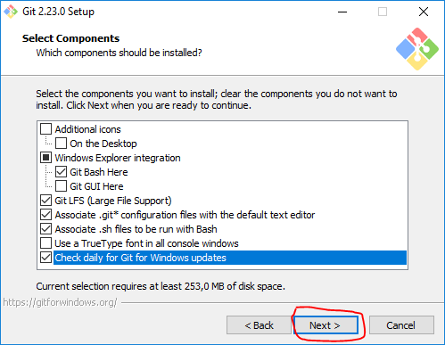

# Git

## 1. Что такое Git

Git - распределённая система управления версиями. Проект был создан Линусом Торвальдсом для
управления разработкой ядра Linux, первая версия выпущена 7 апреля 2005 года. На сегодняшний день
его поддерживает Джунио Хамано.

Разработка ядра Linux велась на проприетарной системе BitKeeper, которую автор, — Ларри Маквой, сам
разработчик Linux, — предоставил проекту по бесплатной лицензии. Разработчики, высококлассные
программисты, написали несколько утилит, и для одной Эндрю Триджелл произвёл реверс-инжиниринг
формата передачи данных BitKeeper. В ответ Маквой обвинил разработчиков в нарушении соглашения и
отозвал лицензию, и Торвальдс взялся за новую систему: ни одна из открытых систем не позволяла
тысячам программистов кооперировать свои усилия (тот же конфликт привёл к написанию Mercurial).
Идеология была проста: взять подход CVS и перевернуть с ног на голову, и заодно добавить
надёжности.

Начальная разработка велась меньше, чем неделю: 3 апреля 2005 года разработка началась, и уже 7
апреля код Git управлялся неготовой системой. 16 июня Linux был переведён на Git, а 25 июля
Торвальдс отказался от обязанностей ведущего разработчика.

Торвальдс так саркастически отозвался о выбранном им названии git (что на английском сленге означает
«мерзавец»):

```text
- I'm an egotistical bastard, so I name all my projects after myself. First Linux, now git.
- Я эгоистичный ублюдок, и поэтому называю все свои проекты в честь себя. Сначала Linux, теперь git.
```

## 2. Основные возможности Git

* Сохранение состояние проекта в определённой время без полной его копии
* Различное изменение файла разными пользователями (ветками)
* Синхронизация состояния проекта между пользователями

## 3. Основные понятия Git

**Репозиторий Git** — каталог файловой системы, в котором находятся: файлы конфигурации, файлы
журналов операций, выполняемых над репозиторием, индекс расположения файлов и хранилище, содержащее
сами контролируемые файлы.

**Ветка (Branch)** — это параллельная версия репозитория. Она включена в этот репозиторий, но не
влияет на главную версию, тем самым позволяя свободно работать в параллельной. Когда вы внесли
нужные изменения, то вы можете объединить их с главной версией.

**Коммит (Commit)** — фиксация изменений или запись изменений в репозиторий. Коммит происходит на
локальной машине.

[Полный список](https://htmlacademy.ru/blog/useful/git/git-and-github-glossary)

## 4. Пример слияния веток


## 5. Установка Git

### Для Windows

1. [Скачать](https://git-scm.com/download/win) с официального сайта [Git](https://git-scm.com)
2. Запустить скачанный файл и произвести установку

* Соглашение с лицензией


* Указание пути для установки


* Выбор компонентов для установки



* Папка для стартового меню


* Выбор текстового редактора


* Выбор окружения


* Выбор SSL библиотеки


* Выбор способа завершения строки


* Выбор терминала


* Выбор дополнительных опций


* Использование экспериментальных функций


* Установка


* Завершение установки


### Для Linux

В отличии от Windows, во всех известных дистрибутивах Linux Git можно установить из стандартных
репозиториев.

* Для debian и debian-like: `sudo apt install git`

### Для Mac

* Через Homebrew: `brew install git`

## 6. Основы работы с командной строкой/терминалом

История создания операционных систем содержит момент, когда компьютеров с графическим интерфейсом
попросту несуществовало. В те времена компьютеры управлялись через специальный дополнительный
терминал. Ситуация изменилась, но наследие осталось, каждая операционная система содержит в себе
терминал или его подобие, с помощью которого можно управлять компьютером. Несмотря на то, что
большой необходимости в терминале сейчас не наблюдается - это очень удобный инструмент для
управления компьютером, его главными плюсами является скорость взаимодействия человека с ОС и
гибкость.

Попробуем добраться до терминала.

### Windows

В Windows понятия терминала нет, оно заменено на понятие
"командная строка". Чтобы запустить командную строку нужно либо найти её в меню "Пуск" по запросу
"командная строка", либо нажать `<Windows>+<R>` и ввести название приложения - `cmd`

### Linux

Для каждого дистрибутива правила запуска терминала разные. По умолчанию - можно либо найти в меню,
либо ввести стандартный макрос `<Ctrl>+<Alt>+<T>`. Но если у вас установлен Linux, то, скорее всего,
вы уже умеет работать с командной строкой

### Mac OS

Не знаю

### Файловая система

Когда вы заходите в терминал/командную строку, в последней выведенной строчке перед курсором описана
строка приглашения. Обычно она содержит также какой либо путь: местоположение в файловой системе,
из которой работает терминал/командная строка. Для того, чтобы перейти в другое место, нужно указать
использовать команду `cd` (от change directory - изменить директорию) и указать ей место в файловой
систему, куда следует перейти. Вложенные директории разделяются символом слэша. В Unix (Linux, Mac
OS) системах прямой слэш `/`, в Windows - обратный слэш `\`.

Например: `cd C:\Users\Admin\Desktop` или `cd /home/admin/Desktop`

Есть два типа указания места в файловой системе:

1. Абсолютный путь

Абсолютный путь - это полное указание директории от корня (или от буквы диска) до директории.
2. Относительный путь

Относительный путь - это указание положения директории от директории, с которой в данный момент
работает командная строка или терминал.

Для относительного пути существуют специальные символы, которые указывают расположение директорий:

* . - эта же директория
* .. - директория на уровень выше

Например, если наше дерево файлов выглядит следующим образом
|- project1

|-- src

|--- main.py

|--- settings.py

|- project2

|-- src

|--- main.py

|--- api.py

и мы находимся в директории `project1/src`, то для того, чтобы перейти в директорию `project2/src`,
нам нужно ввести команду `cd ../../project2/src`. Если после этого мы хотим запустить файл
`project2/images/main.py`, то нужно ввести команду `./main.py`.

Каждая команда, которая вводится в командной строке/терминале - это реально существующая программа
на жёстком диске. Но если мы вводим команду `cd` или команду `dir`, то где же она тогда находится?
Об этом нам может рассказать переменная окружения `PATH`.

Переменные окружения - это специальные значения, которые хранится относительно терминала. Обычно в
них указывается дополнительная информация для работы терминала/командной строки и программ,
запущенных через него. Попробуйте в командной строке/терминала ввести `echo $PATH` и вы увидите
большой список из путей, в Windows разделённых символом `;`, а в Unix системах - символом `:`.
Это пути, в которых терминал/командная строка ищет программы для запуска. После установки Git на
компьютер он также в виде программы оказался на вашем компьютере в одном из путей. Попробуйте ввести
командну `git --version`. В ответ терминал/командная строка должна рассказать вам, какая версия Git
установлена на вашем компьютере.

## 7. Создание тестового репозитория

Репозиторий представляет из себя обычную директорию, расположенную на компьютере. Отличие Git
репозитория от всех остальных директорий в том, что внутри Git репозитория есть специальная
директория `.git`, в которой хранится вся информация о репозитории. Обычно это скрытая директория во
всех системах. Для того, чтобы создать репозиторий, перейдите в директорию, в которой хотите создать
репозиторий и введите команду `git init`. После этого в директории появится директория `.git`.

## 8. Изменение состояния, фиксация

После того, как репозиторий создан, с ним можно работать. Для того чтобы узнать как работать с
репозиторием, введите команду `git --help`. Перед вами появится помощь и перечень команд, которые
можно использовать при работе с репозиторием.

Попробуйте ввести команду `git status`.


Эта команда выводит статус репозитория на данный момент:
есть ли изменённые файлы, есть ли неотслеживаемы файлы, есть ли зафиксированные файлы.

Файлы в репозитории делятся на несколько типов:

* Неотслеживаемые

Файлы, за которыми git не следит и не интересуется тем, изменились они или нет

* Отслеживаемые

Файлы, а которым git следит

* Изменённые

Файлы, за которыми git следит и которые изменились с момента последней фиксации состояния
репозитория

* Зафиксированные

Файлы, за которыми git следит, которые были изменены с момента последней фиксации состояния и
которые были подготовлены для добавления в следующий отпечаток репозитория.

Попробуем изменить состояние репозитория. Создадим в директории файл `main.py`, откроем его через
любой текстовый редактор и напишем туда код на языке Python

```python
print("Hello, world!")
```

Повторно вызовем команду `git status` и изучим то, что появилось в окне терминала/командной строки.


Git добавил файл `main.py` в раздел неотслеживаемых. Нужно добавить этот файл в раздел
отслеживаемых. Это можно сделать с помощью команды `git add <filename>`. Введём `git add main.py`, а
после этого снова проверим статус репозитория. Теперь наш файл попал в раздел зафиксированных.


Чтобы создать отпечаток проект, нужно создать коммит. Коммитом называется состояние проекта в
определённый момент. Для того чтобы создать коммит нужно выполнить команду `git commit`.

> Каждый коммит обязан быть с каким-либо текстовым комментарием к состоянию проекта. Обычно
> описываются выполненные изменения и прочее. Если вы выполните просто команду `git commit`, в ответ
> вам вызовется текстовый редактор, куда следует написать свой комментарий. Но так как работа со
> многими консольными текстовыми редакторами сложна, то я советую указывать комментарий сразу в
> команде создания коммита.

Пример: `git commit -m "Init"`

> Возможно, у вас не удастся сразу создать коммит по причине того, что Git будет требовать от нас
> наши имя и электронную почту. В таком случае нужно пойти на поводу у машины и сообщать данные.
> Сделать это можно со помощью команд, которые буду указаны при появлении ошибки

После создания коммита ещё раз просмотрим состояния репозитория.


Для того чтобы просмотреть историю коммитов, введите команду `git log`.


## 9. Ветки

Ветки позволяют вести параллельную работу над репозиторием с другими разработчиками без конфликтов.
Ветка - это копия репозитория, которая развивается независимо от других веток.

При создании репозитория в нём существет только одна ветка - master. Именно в ней мы и работали.
Чтобы посмотреть существующие ветки, введите команду `git branch`. Звёздочкой указывается ветка, на
которой вы находитесь сейчас.


Создать новую ветку можно с помощью команды `git branch -c <old branch> <new branch>`, где
`<old branch>` - ветка, которая будет основой для новой ветки, `<new branch>` - имя новой ветки.
Создадим ветку `feature_1`.

```shell
git branch -c master feature_1
```

И выведем список существующих веток.


Для того чтобы переключаться между ветками нужно использовать команду `git checkout`. Эта команда
позволяет не только переключаться между ветками, но и переключаться между коммитами. Для того чтобы
сменить ветку нужно ввести `git checkout <branch name>`, где `<branch name>` - имя ветки. Для того,
чтобы посмотреть состояние проекта в определённым коммите, нужно ввести
`git checkout <commit hash>`, где `<commit hash>` - хэш коммита. Хэш коммита можно узнать, посмотрев
историю коммитов с помощью `git log`.

Давайте снова перейдём на ветку `master` с помощью `git checkout master` и перейдём на ветку
`feature_2`, параллельно создав её. Сделать это можно с помощью команды
`git checkout -b <new branch>`, где `<new branch>` - имя новой ветки. Эта ветка будет ответвлена от
той ветки, на которой вы сейчас находитесь, в нашем случае от ветки `master`.

```shell
git checkout -b feature_2
```

Просмотрим состояние веток.


В каждой из веток можно делать различные изменения, которые никак не будут касаться других веток.
Давайте изменим файл `main.py` в ветке `feature_2` каким либо образом, например, добавим новую
строчку

```python
print(100 ** 100)
```

и сделаем новый коммит.
Перейдём в ветку `feature_1` и сделаем изменение там, например, добавим в самое начало файла строчку

```python
print("1" * 7)
```

и сделаем новый коммит.

Теперь каждая ветка хранит в себе полностью различную копию проекта, но при этом все они имеют общие
коммиты. В Git есть возможность слияния веток, то есть добавление изменений из одной ветки в другую.
Для слияния веток используется команда `git merge <branch name>`, где `<branch name>` - имя ветки,
изменения из которой мы хотим добавить в ветку, в которой находимся сейчас.

Перейдём в ветку `master` и сольём в неё сначала ветку `feature_1`, потом `feature_2`.

Сольём в `master` ветку `feature_1`.

```shell
git merge feature_1
```

Посмотрим состояние файла `main.py`.

```python
print("1" * 7)
print("Hello, world!")
```

Теперь сольём в `master` ветку `feature_2`.

```python
git merge feature_2
```

Посмотрим состояние файла `main.py`

```python
print("1" * 7)
print("Hello, world!")
print(100 ** 100)
```

Как видите, изменения из веток `feature_1` и `feature_2` добавились в файл `main.py` без конфликтов.

```text
При слияние веток git может потребовать ввести комментарий к коммиту, который будет создан при
слиянии. В открывшемся текстовом редакторе будет заранее введено стандартное сообщение. Можете
согласится на него и сохранить файл, а можете его изменить.
```

Как изменились коммиты - можно посмотреть в истории коммитов

## 10. Сервисы для хостинга репозиториев

Git очень полезен для совместной разработки, и, как вы понимаете, разработчики, параллельно работая
над задачами, вынуждены иметь общий центр, куда могут добавлять свои наработки и изменения.
В Интернете есть огромное количество сервисов для размещения git репозиториев, самые известные из
них:

1. GitHub.com
2. GitLab.com
3. Bitbucket.com

У каждого и них есть свои плюсы и минусы, но основные функции поддерживают все. **GitHub** стал
де-факто "социальной сетью" для программистов, где разработчики выкладывают свой код в открытый
доступ. **GitLab** отлично подходит для небольших стартапов с развитыми CI/CD, **Bitbucket** -
для крупных компаний с большим уровнем безопасности.

## 11. Использование удалённых репозиториев

Чтобы связать ваш локальный репозиторий на вашем компьютере с удалённым репозиторием, удалённый
репозиторий сначала нужно создать. Рассмотрим создание удалённого репозитория на примере
[GitLab](https://gitlab.com). Для начала нужно зарегистрироваться на странице
[регистрации](https://gitlab.com/users/sign_in#register-pane). После этого нажать кнопку
`Create project` и заполнить поля. После создания репозитория вам будет выдан его URL.

Теперь, когда удалённый репозиторий создан, нужно настроить связь с ним в локальном репозитории. Для
работы с удалёнными репозиториями используется команда `git remote`. Полную справку по работе с
`git remote` можно получить введя команду `git remote --help`.

Для добавления удалённого репозитория нужно испольовать команду `git remote add <name> <url>`, где
`<name>` - имя удалённого репозитория, `<url>` - URL удалённого репозитория. Обычно удалённый
репозиторий называют именем __origin__, но можно назвать и по-другому.

```shell
git remote add gitlab https://gitlab.com/OlegYurchik/test.git
```

После добавления удалённого репозитория нужно добавить все свои изменения из локального репозитория.
Сделать это можно с помощью команды `git push`. Полное описание команды можно посмотреть введя
`git push --help`.
Для создания новой ветки в удалённом репозитории нужно выполнить команду

```shell
git push --set-upstream gitlab master
```

Таким образом в удалённом репозитории появится ветка `master`. Отправьте оставшиеся ветки в
удалённый репозиторий.

В дальнейшем можно использовать просто команду `git push gitlab` для того, чтобы отправить изменения
из ветки, в которой вы сейчас находитесь. Для того, чтобы подтянуть изменения из удалённого
репозитория в локальный репозиторий, используйте команду `git pull`.

## 12. Где изучать Git

Для дополнительного изучения Git в Интернете есть можество ресурсов. Я всегда рекомендую читать
книги, потому как они дают полное понимание того, что вы делаете и с чем работаете. По Git есть
официальная книга на русском языке, найти её можно на официальном сайте Git -
[книга](https://git-scm.com/book/ru/v2).

Но если чтение книг для вас утомительно или не хватает времени, есть краткий курс, который, конечно
же, не даст такого объёма знаний, но научит полностью работать с Git-ом.
[Ссылка](https://githowto.com)
