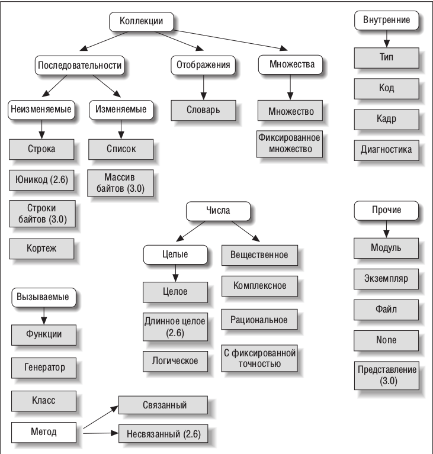
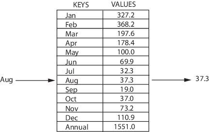
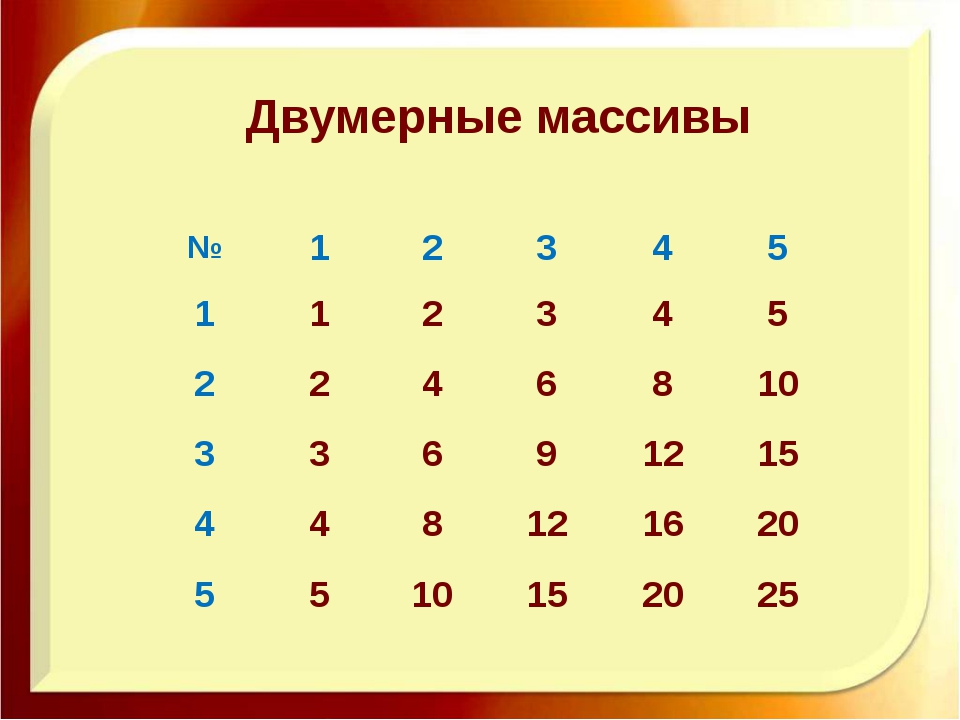

# Встроенные типы и простейшие операции над ними

## 1. Коллекции

Классификация типов данных в Python



На прошлом уроке мы познакомились с простейшими типами данных в Python

1. Целые числа (int)
2. Числа с плаващей запятой (float)
3. Комплексные числа (complex)
4. Строки (str)
5. Логический (bool)
6. NoneType

Сегодня помимо них мы изучим коллекции

1. Строка (str)
2. Список (list)
3. Кортеж (tuple)
4. Словарь (dict)
5. Множество (set)
6. Замороженное множество (frozenset)

Классификация коллекций в Python


Коллекции классифицируются следующим образом:

### Последовательности (sequences) - индексированные, элементы не уникальны

* Изменяемые (mutable): список
* Неизменяемые (immutable): строка, кортеж

### Множества (sets) - неиндексированные, элементы уникальны

* Изменяемые (mutable): множество
* Неизменяемые (immutable): замороженное множество

### Отображения (mappings) - неиндексированный набор пар ключ-значение: словарь

## 2. Понятие объекта

Все данные, с которыми мы работаем в языке Python являются объектами. Понятие объекта мы с вами
подробно рассмотрим при изучении ООП, но главное, что нам надо знать - это то что у каждого объекта
есть атрибуты и методы, доступ к которым можно получить по их имени через оператор точки.

```python
string = "hello, world"
string = string.replace("o", "a")
string = string.reverse()
```

## 3. Последовательности (итераторы)

Последовательность - это объект, который содержит внутри себя много других объектов, которые
расположены друг за другом в определённом порядке.

Из каждой последовательности можно получить определённый объект, зная его положение в
последовательности. Для этого в языке python используется конструкция

```python
print(any_sequence[i])
```

__any_sequence__ - какая-то последовательность, __i__ - какое-то целое число, обозначающее индекс
(позицию) элемента.

Индексы в последовательностях нумеруются от 0 до length - 1, где length - количество элементов в
последовательности.

Пример:

```python
string = "hello"
print(string[0])
print(string[3])
```

В изменяемых (mutable) последовательностях можно заменить один элемент последовательности на другой

```python
lst = [1, 2, 3]
lst[1] = 5
print(lst)
```

Длину последовательности можно узнать с помощью внутренней функции __len()__

```python
string = "hello"
print(len(string))
```

### Строки

Создать строку можно двумя способами:

* Вызвать функцию str

```python
string = str()
```

* Заключить символы между '*', "*" или """*"""

```python
string = ''
string = ""
string = """"""
```

При создании строки можно сразу указать, из каких символов она будет состоять

* Функция str

Между скобок можно указать любой объект - и он будет переведён в строку

```python
string = str(5)
string = str([1, 4, 5])
string = str(True)
```

* Заключить символы между '*', "*" или """*"""

```python
string = 'hello'
string = "hello"
string = """hello
world"""
```

Получить символ в строке, зная его позицию

```python
string = "hello"
print(string[1])
```

Так как строка - неизменяемый тип данных, то мы не сможем заменить определённый символ в ней на
другой

```python
string = "hello"
string[0] = "t" # Неверно
```

#### Самые интересные операции со строками

Строки можно складывать

```python
print("hello," + " world!")
```

Строки можно умножать на целые числа

```python
print("NO! " * 3)
```

Найти индекс подстроки в строке

```python
string = "hello, world!"
print(string.find("ll"))
print(string.find("a"))
```

#### Таблица "Функции и методы строк"

Функция или метод                                  |Назначение
---------------------------------------------------|----------
S = 'str'; S = "str"; S = '''str'''; S = """str""" | Литералы строк
S = "s\np\ta\nbbb"                                 | Экранированные последовательности
S = r"C:\temp\new"                                 | Неформатированные строки (подавляют
экранирование)
S = b"byte"                                        | Строка байтов
S1 + S2                                            | Конкатенация (сложение строк)
S1 * i                                             | Повторение строки i раз
symbol in s                                        | Проверка, есть ли символ symbol в строке
S[i]                                               | Обращение по индексу
S[i:j:step]                                        | Извлечение среза
len(S)                                             | Длина строки
S.find(str, [start],[end])                         | Поиск подстроки в строке. Возвращает номер
первого вхождения или -1
S.rfind(str, [start],[end])                        | Поиск подстроки в строке. Возвращает номер
последнего вхождения или -1
S.index(str, [start],[end])                        | Поиск подстроки в строке. Возвращает номер
первого вхождения или вызывает ValueError
S.rindex(str, [start],[end])                       | Поиск подстроки в строке. Возвращает номер
последнего вхождения или вызывает ValueError
S.replace(шаблон, замена)                          | Замена шаблона
S.split(символ)                                    | Разбиение строки по разделителю
S.isdigit()                                        | Состоит ли строка из цифр
S.isalpha()                                        | Состоит ли строка из букв
S.isalnum()                                        | Состоит ли строка из цифр или букв
S.islower()                                        | Состоит ли строка из символов в нижнем
регистре
S.isupper()                                        | Состоит ли строка из символов в верхнем
регистре
S.isspace()                                        | Состоит ли строка из неотображаемых символов
(пробел, символ перевода страницы ('\f'), "новая строка" ('\n'), "перевод каретки" ('\r'),
"горизонтальная табуляция" ('\t') и "вертикальная табуляция" ('\v'))
S.istitle()                                        | Начинаются ли слова в строке с заглавной
буквы
S.upper()                                          | Преобразование строки к верхнему регистру
S.lower()                                          | Преобразование строки к нижнему регистру
S.startswith(str)                                  | Начинается ли строка S с шаблона str
S.endswith(str)                                    | Заканчивается ли строка S шаблоном str
S.join(список)                                     | Сборка строки из списка с разделителем S
ord(символ)                                        | Символ в его код ASCII
chr(число)                                         | Код ASCII в символ
S.capitalize()                                     | Переводит первый символ строки в верхний
регистр, а все остальные в нижний
S.center(width, [fill])                            | Возвращает отцентрованную строку, по краям
которой стоит символ fill (пробел по умолчанию)
S.count(str, [start],[end])                        | Возвращает количество непересекающихся
вхождений подстроки в диапазоне [начало, конец] (0 и длина строки по умолчанию)
S.expandtabs([tabsize])                            | Возвращает копию строки, в которой все
символы табуляции заменяются одним или несколькими пробелами, в зависимости от текущего столбца.
Если TabSize не указан, размер табуляции полагается равным 8 пробелам
S.lstrip([chars])                                  | Удаление пробельных символов в начале строки
S.rstrip([chars])                                  | Удаление пробельных символов в конце строки
S.strip([chars])                                   | Удаление пробельных символов в начале и в
конце строки
S.partition(шаблон)                                | Возвращает кортеж, содержащий часть перед
первым шаблоном, сам шаблон, и часть после шаблона. Если шаблон не найден, возвращается кортеж,
содержащий саму строку, а затем две пустых строки
S.rpartition(sep)                                  | Возвращает кортеж, содержащий часть перед
последним шаблоном, сам шаблон, и часть после шаблона. Если шаблон не найден, возвращается кортеж,
содержащий две пустых строки, а затем саму строку
S.swapcase()                                       | Переводит символы нижнего регистра в верхний,
а верхнего – в нижний
S.title()                                          | Первую букву каждого слова переводит в
верхний регистр, а все остальные в нижний
S.zfill(width)                                     | Делает длину строки не меньшей width, по
необходимости заполняя первые символы нулями
S.ljust(width, fillchar=" ")                       | Делает длину строки не меньшей width, по
необходимости заполняя последние символы символом fillchar
S.rjust(width, fillchar=" ")                       | Делает длину строки не меньшей width, по
необходимости заполняя первые символы символом fillchar
S.format(*args, **kwargs)                          | Форматирование строки

### Списки

Создать список можно двумя способами:

* Вызывать функцию list()

```python
lst = list()
```

* Использовать квадратные скобки

```python
lst = []
```

При создании списка можно сразу указать, из каких элементов он будет состоять

* Функция list
Между скобок можно указать любую последовательность - и на её основе будет сделан список

```python
lst = list([1, 4, 5])
lst = list("hello")
```

* Использовать квадратные скобки

```python
lst = ["h", 1, 3.5, True, None]
```

Получить элемент последовательности, зная его позицию

```python
lst = [4, 3, 2, 1]
print(lst[1])
```

Так как список - изменяемый тип данных, то мы можем заменить определённый элемент в нём на другой

```python
lst = [4, 3, 2, 1]
lst[0] = 8
```

#### Самые интересные операции со списками

Списки можно складывать

```python
print([1, 2] + [3, 4])
```

Списки можно умножать на целые числа

```python
print([1, 2] * 3)
```

Найти индекс элемента в списке

```python
lst = [1, 2, 3, 4, 5, 6, 7]
print(lst.index(4))
print(lst.index(10))
```

#### Таблица "Функции и методы списков"

Функция или метод                       | Назначение
----------------------------------------|-----------
lst1 + lst2                             | Сложение списков - второй список прибавляется к первому
lst1 * i                                | Повторение списка i раз
elem in lst                             | Проверка, есть ли элемент elem в списке lst
lst[i]                                  | Обращение по индексу
lst[i:j:step]                           | Извлечение среза
len(lst)                                | Длина списка
lst.append(x)                           | Добавляет элемент в конец списка
lst.extend(L)                           | Расширяет список list, добавляя в конец все элементы
списка L
lst.insert(i, x)                        | Вставляет на i-ый элемент значение x
lst.remove(x)                           | Удаляет первый элемент в списке, имеющий значение x.
ValueError, если такого элемента не существует
lst.pop([i])                            | Удаляет i-ый элемент и возвращает его. Если индекс не
указан, удаляется последний элемент
lst.index(x, [start [, end]])           | Возвращает положение первого элемента со значением x
(при этом поиск ведется от start до end)
lst.count(x)                            | Возвращает количество элементов со значением x
lst.sort([key=функция, reverse=False])  | Сортирует список на основе функции
lst.reverse()                           | Разворачивает список
lst.copy()                              | Поверхностная копия списка
lst.clear()                             | Очищает список
Нужно отметить, что методы списков, в отличие от строковых методов, изменяют сам список, а потому
результат выполнения не нужно записывать в эту переменную.

```python
lst = [3, 1, 6, 4, 0]
lst.sort()
print(lst)
lst = lst.sort()
print(lst)
```

### Кортежи

Создать кортеж можно двумя способами:

* Вызывать функцию tuple()

```python
tpl = tuple()
```

* Использовать круглые скобки с запятой внутри

```python
tuple = (,)
```

При создании кортежа можно сразу указать, из каких элементов он будет состоять

* Функция tuple

Между скобок можно указать любую последовательность - и на её основе будет сделан кортеж

```python
tpl = tuple([1, 4, 5])
tpl = tuple("hello")
```

* Использовать квадратные скобки

```python
tpl = ("h", 1, 3.5, True, None)
```

Получить элемент последовательности, зная его позицию

```python
tpl = (4, 3, 2, 1)
print(tpl[1])
```

Так как кортеж - неизменяемый тип данных, то мы не можем заменить определённый элемент в нём на
другой

```python
tpl = (4, 3, 2, 1)
tpl[0] = 8 # Неправильно
```

#### Зачем нужны кортежи, если есть списки

* Защита от дурака. То есть кортеж защищен от изменений, как намеренных (что плохо), так и случайных
(что хорошо).
* Меньший размер. Дабы не быть голословным:

```python
a = (1, 2, 3, 4, 5, 6)
b = [1, 2, 3, 4, 5, 6]
a.__sizeof__()
b.__sizeof__()
```

#### Самые интересные операции с кортежами

Кортежи можно складывать

```python
print((1, 2) + (3, 4))
```

Кортежи можно умножать на целые числа

```python
print((1, 2) * 3)
```

Найти индекс элемента в кортеже

```python
tpl = (1, 2, 3, 4, 5, 6, 7)
print(tpl.index(4))
print(tpl.index(10))
```

Например, гордость программистов Python - поменять местами значения двух переменных:

```python
a, b = b, a
```

#### Таблица "Функции и методы кортежей"

Функция или метод                       | Назначение
----------------------------------------|-----------
tpl1 + tpl2                             | Сложение кортежей - второй кортеж прибавляется к первому
tpl * i                                 | Повторение кортежа i раз
elem in tpl                             | Проверка, есть ли элемент elem в кортеже
tpl[i]                                  | Обращение по индексу
tpl[i:j:step]                           | Извлечение среза
len(tpl)                                | Длина кортежа
tpl.index(x, [start [, end]])           | Возвращает положение первого элемента со значением x
(при этом поиск ведется от start до end)
tpl.count(x)                            | Возвращает количество элементов со значением x

### Отрицательные индексы

У каждой последовательности мы можем получить определённый элемент, если укажем его индекс в
квадратных скобках. Если укажем число, которое равно или больше количества элементов в
последовательности, то получим ошибку.
Но если мы укажем число меньше 0, то всё равно будем получать элементы последовательности

```python
lst = [1, 2, 3]
print(lst[0])
print(lst[-1])
```

Это сделано для нашего удобства, чтобы мы могли брать элементы, отсчитывая их не только с начала
последовательности, но и с конца. Таким образом, взяв -1 элемент - мы получим последний элемент
последовательности, взяв -2 элемент - предпоследний и так далее. Если мы возьмём __- length - 1__
элемент, где length - длина последовательности, то получим ошибку.

### Взятие среза

У каждой последовательности можно брать не только один элемент из неё, но и целую
подпоследовательность. Сделать это также можно с помощью квадратных скобок.
sqn[begin:end:step] - где __sqn__ - последовательность, __begin__ (по умолчанию 0) - индекс, с
которого начинаем брать подпоследовательность, __end__ (по умолчанию длина последовательности) -
индекс, элемент с которым уже не входит в подпоследовательность, __step__ (по умолчанию 1) - шаг, с
которым выбираем элементы для подпоследовательности.

```python
lst = [0, 1, 2, 3, 4, 5, 6, 7, 8, 9]
print(lst[1])
print(lst[1:8])
print(lst[:8])
print(lst[1:8:2])
print(lst[::2])
print(lst[8:1:-1])
print(lst[::-1])
```

В изменяемых последовательностях (списки) можно также заменять срез на другой список

```python
lst = [0, 1, 2, 3, 4, 5, 6, 7, 8, 9]
lst[1:4] = [20, 30]
print(lst)
```

На <http://informatics.msk.ru> показать пример выполнения задачи на задаче
* [№2937](https://informatics.msk.ru/mod/statements/view3.php?id=2296&chapterid=2937)

Выполнить задачи:

* №338

## 4. Множества

Множество в Python - это объект, содержащий не повторяющиеся элементы в случайном порядке.

### Множества

Множество - это изменяемый неиндексированный объект, содержащий в себе неповторяющиеся элементы
Создать множество можно двумя способами:

* Функция set

```python
st = set()
```

* Фигурные скобки (обязательно перечислить начальные элементы)

```python
st = {1, 2}
```

При создании множества можно сразу указать, из каких элементов оно будет состоять

* Функция set

Между скобок можно указать любую последовательность - и на её основе будет сделано множество

```python
st = set([1, 4, 5])
st = set("hello")
```

* Использовать фигурные скобки

```python
st = {"h", 1, 3.5, True, None}
```

#### Таблица "Функции и методы множеств"

Функция или метод                                         | Назначение
----------------------------------------------------------|-----------
len(s)                                                    | число элементов в множестве (размер
множества).
x in s                                                    | принадлежит ли x множеству s.
set.isdisjoint(other)                                     | истина, если set и other не имеют
общих элементов.
set == other                                              | все элементы set принадлежат other,
все элементы other принадлежат set.
set.issubset(other) или set <= other                      | все элементы set принадлежат other.
set.issuperset(other) или set >= other                    | аналогично.
set.union(other, ...) или set | other | ...               | объединение нескольких множеств.
set.intersection(other, ...) или set & other & ...        | пересечение.
set.difference(other, ...) или set - other - ...          | множество из всех элементов set, не
принадлежащие ни одному из other.
set.symmetric_difference(other); set ^ other              | множество из элементов, встречающихся
в одном множестве, но не встречающиеся в обоих.
set.copy()                                                | копия множества.
set.update(other, ...); set |= other | ...                | объединение.
set.intersection_update(other, ...); set &= other & ...   | пересечение.
set.difference_update(other, ...); set -= other | ...     | вычитание.
set.symmetric_difference_update(other); set ^= other      | множество из элементов, встречающихся
в одном множестве, но не встречающиеся в обоих.
set.add(elem)                                             | добавляет элемент в множество.
set.remove(elem)                                          | удаляет элемент из множества.
KeyError, если такого элемента не существует.
set.discard(elem)                                         | удаляет элемент, если он находится в
множестве.
set.pop()                                                 | удаляет первый элемент из множества.
Так как множества не упорядочены, нельзя точно сказать, какой элемент будет первым.
set.clear()                                               | очистка множества.

#### Замороженные множества

Замороженное множество - это неизменяемый неиндексированный объект, содержащий в себе
неповторяющиеся элементы
Создать замороженное множество можно следующим образом:

* Функция frozenset

```python
frznst = frozenset()
```

При создании множества можно сразу указать, из каких элементов оно будет состоять

* Функция frozenset

Между скобок можно указать любую последовательность - и на её основе будет сделано множество

```python
frznst = frozenset([1, 4, 5])
frznst = frozenset("hello")
```

#### Таблица "Функции и методы замороженных множеств"

Функция или метод                                         | Назначение
----------------------------------------------------------|-----------
len(frzn)                                                 | число элементов в множестве (размер
множества).
x in frzn                                                 | принадлежит ли x множеству s.
frznst.isdisjoint(other)                                  | истина, если set и other не имеют
общих элементов.
frznst == other                                           | все элементы set принадлежат other,
все элементы other принадлежат set.
frznst.issubset(other) или frznst <= other                | все элементы set принадлежат other.
frznst.issuperset(other) или frznst >= other              | аналогично.
frznst.union(other, ...) или frznst | other | ...         | объединение нескольких множеств.
frznst.intersection(other, ...) или frznst & other & ...  | пересечение.
frznst.difference(other, ...) или set - other - ...       | множество из всех элементов set, не
принадлежащие ни одному из other.
frznst.symmetric_difference(other); frznst ^ other        | множество из элементов, встречающихся
в одном множестве, но не встречающиеся в обоих.
frznst.copy()                                             | копия множества.

## 6. Отображения

Из стандартных типов только словарь является отображением

### Словарь

Словарь содержит в себе структуру ключ-значение

Словарь можно создать двумя способами:

* Функция dict

```python
dct = dict()
```

* Фигурные скобки

```python
dct = {}
```

При создании словаря можно сразу указать, из каких элементов он будет состоять

* Функция dict

Между скобок нужно указать последовательность, которая также состоит из последовательностей длиной в
2 элемента. Первый элемент будет использоваться как ключ, а второй - как значение

```python
dct = dict((("1", 1), ("2", 2), ("3", 3)))
```

* Использовать фигурные скобки

```python
dct = {"1": 1, "2": 2}
```

Получить значение по ключу можно с помощью квадратных скобок

```python
dct = {"1": 1, "2": 2}
print(dct["1"])
print(dct["2"])
```

Если указать несуществующий ключ, то получим ошибку

#### Таблица "Функции и методы словарей"

Функция или метод                 | Назначение
----------------------------------|-----------
len(dct)                          | длина словаря
dct[key]                          | взятие значение по ключу key
dct.clear()                       | очищает словарь
dct.copy()                        | возвращает копию словаря
dict.fromkeys(seq[, value])       | создает словарь с ключами из seq и значением value (по
умолчанию None).
dct.get(key[, default])           | возвращает значение ключа, но если его нет, не бросает
исключение, а возвращает default (по умолчанию None).
dct.items()                       | возвращает пары (ключ, значение).
dct.keys()                        | возвращает ключи в словаре.
dct.pop(key[, default])           | удаляет ключ и возвращает значение. Если ключа нет, возвращает
default (по умолчанию бросает исключение).
dct.popitem()                     | удаляет и возвращает пару (ключ, значение). Если словарь пуст,
бросает исключение KeyError. Помните, что словари неупорядочены.
dct.setdefault(key[, default])    | возвращает значение ключа, но если его нет, не бросает
исключение, а создает ключ с значением default (по умолчанию None).
dct.update([other])               | обновляет словарь, добавляя пары (ключ, значение) из other.
Существующие ключи перезаписываются. Возвращает None (не новый словарь!).
dct.values()                      | возвращает значения в словаре.

## 7. Вложенные списки (матрицы)

Из списков, не смотря на их простую структуру, можно создавать довольно сложные и интересные
системы. В Python нет таких понятий, как массив и многомерный массив. Но здесь они и не нужны, все
базовые типы данных гибки настолько, что с помощью них можно реализовать любую привычную структуру
из других языков программирования.

### Что такое многомерные массивы

Да, у массивов может быть несколько измерений. Конечно, на практике четырёхмерные и более массивы не
применяются совсем, так что рассматривать мы их не будем, а затронем только тему двумерных.

Что из себя представляет двумерный массив?
Самое удобная ассоциация для двумерного массива - это таблица.



Такую же "таблицу" (а лучше всё-таки сказать массив) из чисел мы можем получить и с помощью языка
Python

```python
matrix = [[1, 2, 3, 4, 5],
          [2, 4, 6, 8, 9],
          [3, 6, 9, 12, 15],
          [4, 8, 12, 16, 20],
          [5, 10, 15, 20, 25]]
print(matrix[0])
print(matrix[1][2])
print(matrix[3][4])
```

По сути, двумерный массив - это список, состоящий из списков. Необязательно использовать именно
списки, могут подойти и кортежи, но только в том случае, если вы не собираетесь изменять элементы
матрицы/ В математике такие двумерные массивы называют матрицами, и для них есть собственная логика,
операции и прочее.

## 8. Домашнее задание

Обязательно:

* №3443 (<https://informatics.msk.ru/mod/statements/view.php?id=3290>)
* №3445 (<https://informatics.msk.ru/mod/statements/view3.php?id=3290&chapterid=3445>)
* №3455 (<https://informatics.msk.ru/mod/statements/view.php?id=3309>)
* №3456 (<https://informatics.msk.ru/mod/statements/view3.php?id=3309&chapterid=3456>)
* №3502 (<https://informatics.msk.ru/mod/statements/view3.php?id=3380&chapterid=3502>)
* №3503 (<https://informatics.msk.ru/mod/statements/view3.php?id=3380&chapterid=3503>)
* №3735 (<https://informatics.msk.ru/mod/statements/view.php?id=3863>)
* №3736 (<https://informatics.msk.ru/mod/statements/view3.php?id=3863&chapterid=3736>)
* №111300 (<https://informatics.msk.ru/mod/statements/view.php?id=5761>)
* №111301 (<https://informatics.msk.ru/mod/statements/view3.php?id=5761&chapterid=111301>)
* №111318 (<https://informatics.msk.ru/mod/statements/view3.php?id=5761&chapterid=111318>)
* Прочесть Укус Питона - Глава 9

По желанию:

* Весь раздел "Ввод-вывод" (<https://informatics.msk.ru/mod/statements/view.php?id=2296>)
* Весь раздел "Условный оператор" (<https://informatics.msk.ru/mod/statements/view.php?id=276>)
* Прочесть Марк Лутц - Главы 7-9
