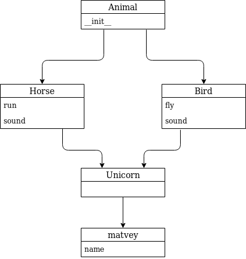
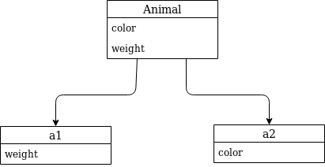

# Объектно-ориентированное программирование

## 1. Понятие ООП

Объе́ктно-ориентированное программирование (ООП) — методология программирования, основанная на
представлении программы в виде совокупности объектов, каждый из которых является экземпляром
определённого класса, а классы образуют иерархию наследования.

### История

ООП возникло в результате развития идеологии процедурного программирования, где данные и
подпрограммы (процедуры, функции) их обработки формально не связаны. Для дальнейшего развития
объектно-ориентированного программирования часто большое значение имеют понятия события (так
называемое событийно-ориентированное программирование) и компонента (компонентное программирование,
КОП).

Взаимодействие объектов происходит посредством сообщений. Результатом дальнейшего развития ООП,
по-видимому, будет агентно-ориентированое программирование, где агенты — независимые части кода на
уровне выполнения. Взаимодействие агентов происходит посредством изменения среды, в которой они
находятся.

Языковые конструкции, конструктивно не относящиеся непосредственно к объектам, но сопутствующие им
для их безопасной (исключительные ситуации, проверки) и эффективной работы, инкапсулируются от них в
аспекты (в аспектно-ориентированном программировании). Субъектно-ориентированное программирование
расширяет понятие объекта посредством обеспечения более унифицированного и независимого
взаимодействия объектов. Может являться переходной стадией между ООП и агентным программированием в
части самостоятельного их взаимодействия.

Первым языком программирования, в котором были предложены основные понятия, впоследствии сложившиеся
в парадигму, была Симула, но термин «объектная ориентированность» не использовался в контексте
использования этого языка. В момент его появления в 1967 году в нём были предложены революционные
идеи: объекты, классы, виртуальные методы и др., однако это всё не было воспринято современниками
как нечто грандиозное. Фактически, Симула была «Алголом с классами», упрощающим выражение в
процедурном программировании многих сложных концепций. Понятие класса в Симуле может быть полностью
определено через композицию конструкций Алгола (то есть класс в Симуле — это нечто сложное,
описываемое посредством примитивов).

Взгляд на программирование «под новым углом» (отличным от процедурного) предложили Алан Кэй и Дэн
Ингаллс в языке Smalltalk. Здесь понятие класса стало основообразующей идеей для всех остальных
конструкций языка (то есть класс в Смолтоке является примитивом, посредством которого описаны более
сложные конструкции). Именно он стал первым широко распространённым объектно-ориентированным языком
программирования.

В настоящее время количество прикладных языков программирования (список языков), реализующих
объектно-ориентированную парадигму, является наибольшим по отношению к другим парадигмам. Наиболее
распространённые в промышленности языки (С++, Delphi, C#, Java и др.) воплощают объектную модель
Симулы. Примерами языков, опирающихся на модель Смолтока, являются Objective-C, Python, Ruby.

### Абстракция данных

Абстрагирование означает выделение значимой информации и исключение из рассмотрения незначимой. В
ООП рассматривают лишь абстракцию данных (нередко называя её просто «абстракцией»), подразумевая
набор наиболее значимых характеристик объекта, доступных остальной программе.

Пример:

Представьте, что водитель едет в автомобиле по оживлённому участку движения. Понятно, что в этот
момент он не будет задумываться о химическом составе краски автомобиля, особенностях взаимодействия
шестерён в коробке передач или влияния формы кузова на скорость (разве что, автомобиль стоит в
глухой пробке и водителю абсолютно нечем заняться). Однако, руль, педали, указатель поворота (ну и,
возможно, пепельницу) он будет использовать регулярно.

### Инкапсуляция

Инкапсуляция — свойство системы, позволяющее объединить данные и методы, работающие с ними, в
классе. Одни языки (например, С++, Java или Ruby) отождествляют инкапсуляцию с сокрытием, но другие
(Smalltalk, Eiffel, OCaml) различают эти понятия.

Пример:

Представим на минутку, что мы оказались в конце позапрошлого века, когда Генри Форд ещё не придумал
конвейер, а первые попытки создать автомобиль сталкивались с критикой властей по поводу того, что
эти коптящие монстры загрязняют воздух и пугают лошадей. Представим, что для управления первым
паровым автомобилем необходимо было знать, как устроен паровой котёл, постоянно подбрасывать уголь,
следить за температурой, уровнем воды. При этом для поворота колёс использовать два рычага, каждый
из которых поворачивает одно колесо в отдельности. Думаю, можно согласиться с тем, что вождение
автомобиля того времени было весьма неудобным и трудным занятием.

Теперь вернёмся в сегодняшний день к современным чудесам автопрома с коробкой-автоматом. На самом
деле, по сути, ничего не изменилось. Бензонасос всё так же поставляет бензин в двигатель,
дифференциалы обеспечивают поворот колёс на различающиеся углы, коленвал превращает поступательное
движение поршня во вращательное движение колёс. Прогресс в другом. Сейчас все эти действия скрыты от
пользователя и позволяют ему крутить руль и нажимать на педаль газа, не задумываясь, что в это время
происходит с инжектором, дроссельной заслонкой и распредвалом. Именно сокрытие внутренних процессов,
происходящих в автомобиле, позволяет эффективно его использовать даже тем, кто не является
профессионалом-автомехаником с двадцатилетним стажем. Это сокрытие в ООП носит название
инкапсуляции.

### Наследование

Наследование — свойство системы, позволяющее описать новый класс на основе уже существующего с
частично или полностью заимствующейся функциональностью. Класс, от которого производится
наследование, называется базовым, родительским или суперклассом. Новый класс — потомком,
наследником, дочерним или производным классом.

Пример:

Представим себя, на минуту, инженерами автомобильного завода. Нашей задачей является разработка
современного автомобиля. У нас уже есть предыдущая модель, которая отлично зарекомендовала себя в
течение многолетнего использования. Всё бы хорошо, но времена и технологии меняются, а наш
современный завод должен стремиться повышать удобство и комфорт выпускаемой продукции и
соответствовать современным стандартам.

Нам необходимо выпустить целый модельный ряд автомобилей: седан, универсал и малолитражный хэтч-бэк.
Очевидно, что мы не собираемся проектировать новый автомобиль с нуля, а, взяв за основу предыдущее
поколение, внесём ряд конструктивных изменений. Например, добавим гидроусилитель руля и уменьшим
зазоры между крыльями и крышкой капота, поставим противотуманные фонари. Кроме того, в каждой модели
будет изменена форма кузова.

Очевидно, что все три модификации будут иметь большинство свойств прежней модели (старый добрый
двигатель 1970 года, непробиваемая ходовая часть, зарекомендовавшая себя отличным образом на
отечественных дорогах, коробку передач и т.д.). При этом каждая из моделей будет реализовать
некоторую новую функциональность или конструктивную особенность. В данном случае, мы имеем дело с
наследованием.

### Полиморфизм подтипов

Полиморфизм подтипов (в ООП называемый просто «полиморфизмом») — свойство системы, позволяющее
использовать объекты с одинаковым интерфейсом без информации о типе и внутренней структуре объекта.
Другой вид полиморфизма — параметрический — в ООП называют обобщённым программированием.

Пример:

Любое обучение вождению не имело бы смысла, если бы человек, научившийся водить, скажем, ВАЗ 2106 не
мог потом водить ВАЗ 2110 или BMW X3. С другой стороны, трудно представить человека, который смог бы
нормально управлять автомобилем, в котором педаль газа находится левее педали тормоза, а вместо руля
– джойстик.

Всё дело в том, что основные элементы управления автомобиля имеют одну и ту же конструкцию и принцип
действия. Водитель точно знает, что для того, чтобы повернуть налево, он должен повернуть руль,
независимо от того, есть там гидроусилитель или нет.
Если человеку надо доехать с работы до дома, то он сядет за руль автомобиля и будет выполнять одни и
те же действия, независимо от того, какой именно тип автомобиля он использует. По сути, можно
сказать, что все автомобили имеют один и тот же интерфейс, а водитель, абстрагируясь от сущности
автомобиля, работает именно с этим интерфейсом. Если водителю предстоит ехать по немецкому автобану,
он, вероятно выберет быстрый автомобиль с низкой посадкой, а если предстоит возвращаться из
отдалённого маральника в Горном Алтае после дождя, скорее всего, будет выбран УАЗ с армейскими
мостами. Но, независимо от того, каким образом будет реализовываться движение и внутреннее
функционирование машины, интерфейс останется прежним.

### Класс

Класс — универсальный, комплексный тип данных, состоящий из тематически единого набора «полей»
(переменных более элементарных типов) и «методов» (функций для работы с этими полями), то есть он
является моделью информационной сущности с внутренним и внешним интерфейсами для оперирования своим
содержимым (значениями полей). В частности, в классах широко используются специальные блоки из
одного или чаще двух спаренных методов, отвечающих за элементарные операции с определённым полем
(интерфейс присваивания и считывания значения), которые имитируют непосредственный доступ к полю.
Эти блоки называются «свойствами» и почти совпадают по конкретному имени со своим полем (например,
имя поля может начинаться со строчной, а имя свойства — с заглавной буквы). Другим проявлением
интерфейсной природы класса является то, что при копировании соответствующей переменной через
присваивание копируется только интерфейс, но не сами данные, то есть класс — ссылочный тип данных.
Переменная-объект, относящаяся к заданному классом типу, называется экземпляром этого класса. При
этом в некоторых исполняющих системах класс также может представляться некоторым объектом при
выполнении программы посредством динамической идентификации типа данных. Обычно классы разрабатывают
таким образом, чтобы обеспечить отвечающие природе объекта и решаемой задаче целостность данных
объекта, а также удобный и простой интерфейс. В свою очередь, целостность предметной области
объектов и их интерфейсов, а также удобство их проектирования, обеспечивается наследованием.

### Объект

Сущность в адресном пространстве вычислительной системы, появляющаяся при создании экземпляра класса
(например, после запуска результатов компиляции и связывания исходного кода на выполнение).

## 2. Класс, объект

Когда речь идёт об объектно-ориентированном программирование в Python, первое, что нужно сказать -
это то что любые переменные любых типов данных являются объектами, а типы являются классами.

Каждый объект имеет набор атрибутов, к которым можно получить доступ с помощью оператора `.`. Мы уже
имеем опыта работы с атрибутами, пример списков:

```python
lst = [1, 2, 3]
lst.append(4)    # Обращение к атрибуту
```

Атрибуты, которые являются функциями, называются методами.

Создадим класс можно с помощью конструкции `class` без атрибутов

```python
# Создание пустого класса Animal
class Animal:
    pass
```

Для того чтобы создать объект на основе класса __Animal__ нужно вызвать его как функцию.

```python
animal = Animal()
```

Для определения, к какому классу относится объект, можно вызвать внутренний атрибут объекта
__\_\_class\_\___. Также можно воспользоваться функцией **isinstance** (рекомендуется этот вариант).

```python
print(isinstance(animal, Animal))
print(animal.__class__)

# Поля объекта
print(dir(animal))
```

Создадим новый класс Animal с атрибутами и экземпляр этого класса

```python
class Animal:
    color = "red"
    weight = 200

animal = Animal()

# Определить класс объекта
print(isinstance(animal, Animal))
print(animal.__class__)

# Поля объекта
print(dir(animal))
print(animal.color)
print(animal.weight)
```

Создадим два экземпляра класса и изменим их атрибуты

```python
class Animal:
    color = "red"
    weight = 200

a1 = Animal()
a2 = Animal()

a1.weight = 400
print(a1.color, a1.weight)
a2.color = "blue"
print(a2.color, a2.weight)
```

Внутри объектов также можно создавать новые атрибуты, например

```python
a1.speed = 300
a2.speed = 400
print(a1.color, a1.weight, a1.speed)
print(a2.color, a2.weight, a2.speed)
```

Класс `Animal` так же является объектом и внутри него так же есть атрибуты, как и внутри объектов,
созданных с помощью класса `Animal`.

```python
print(Animal.color, Animal.weight)

Animal.color = "green"
Animal.weight = 300

print(a1.color, a1.weight, a1.speed)
print(a2.color, a2.weight, a2.speed)
```

Как вы могли заметить, в объектах изменились значения только тех атрибутов, которые мы не меняли до
этого в этих объектах. Это поведение будет объяснено позже.

## 3. Методы, конструктор, деструктор

Для объявления методов внутри класса нужно просто создать функцию внутри класса. Эта функция должна
принимать как минимум один аргумент. По общепринятому соглашению этот аргумент называется `self` и
в него передаётся сам объект класса, из которого этот метод и вызывается.

Пример:

```python
class Animal:
    def set(self, value):
        self.value = value

    def print(self):
        print("VALUE:", self.value)


animal = Animal()
animal.set(20)
animal.print()
animal.set("Of horse")
animal.print()
```

### Конструктор

В классах можно описывать так называемые "волшебные" методы, то есть методы, которые имеют заранее
прописанный функционал в языке Python. Одним из таких методов является конструктор.

Конструктор - специальный метод, который вызывается сразу же после создания объекта и производит
первичные действия.

Чтобы создать конструктор в Python - нужно создать функции в классе с именем `__init__`.

Пример:

```python
class Animal:
    def __init__(self, color, weight):
        self.color = color
        self.weight = weight

a1 = Animal("red", 300)
a2 = Animal("green", 200)

a1.color = "blue"
a2.weight = 500

print(a1.color, a1.weight)
print(a2.color, a2.weight)
```

Как видите, теперь при создании объекта нужно передавать все аргументы, кроме `self`, которые
принимаются в конструкторе.

### Деструктор

Также существует такой "волшебный" метод который называется деструктор. Он вызывается в момент
удаления объекта из памяти.

```python
class Animal:
    def __init__(self, name):
        self.name = name

    def __del__(self):
        print(self.name, "will deleted.")


a1 = Animal("Kent")
a2 = Animal("Afon")
a3 = Animal("Zuk")

del a2              # Удаление переменной
```

Как видите, сначала на экран вывелась строка об удалении Afon, а потом об удалении остальных
объектов. Несмотря на то, что мы явно их не удаляем, они всё равно удаляются при достижении
программой конца.

## 4. Наследование

Наследование (англ. inheritance) — концепция объектно-ориентированного программирования, согласно
которой абстрактный тип данных может наследовать данные и функциональность некоторого существующего
типа, способствуя повторному использованию компонентов программного обеспечения.

Можно создать класс, который наследуется от другого класса. Таким образом наследуемый класс будет
называться дочерним, а класс, от которого наследуются - родительским. Таким образом дочерний класс
наследует все атрибуты родительского класса. Для создания класса, наследуемого от другого класса
нужно указать родительский класс в скобках после имени дочернего класса.

Пример:

```python
class Animal:
    def __init__(self, name):
        self.name = name

    def sound(self):
        print("Any sound")

    def sleep(self, hours):
        print(self.name, "sleep", hours, "hours")

class Cow(Animal):
    def __init__(self, name):
        super().__init__(self, name)

    def sound(self):
        print("Moo")

murka = Cow("murka")
murka.sound()
```

Класс `Cow` унаследовал метод `sleep`, а методы `__init__` и `sound` были перезаписаны в дочернем
классе.

## 5. Двойное наследование

Класс может быть унаследован от нескольких классов.

```python
class Animal:
    def __init__(self, name):
        self.name = name


class Horse(Animal):
    def run(self, distance):
        print(self.name, "run", distance, "meters")


class Bird(Animal):
    def fly(self, distance):
        print(self.name, "fly", distance, "meters")


class Unicorn(Horse, Bird):
    pass


matvey = Unicorn("Matvey")
matvey.run(20)
matvey.fly(800)
```

Чтобы унаследовать класс от нескольких классов нужно перечислить родительские классы в скобках через
запятую. Таким образом класс `Unicorn` получит конструктор из класса `Animal`, `run` из класса
`Horse` и `fly` из класса `Bird`.

## 6. Полиморфизм

```python
class Animal:
    def __init__(self, name):
        self.name = name


class Horse(Animal):
    def run(self, distance):
        print(self.name, "run", distance, "meters")

    def sound(self):
        print(self.name, "says: igogo")


class Bird(Animal):
    def fly(self, distance):
        print(self.name, "fly", distance, "meters")

    def sound(self):
        print(self.name, "says: chirik")


class Unicorn(Horse, Bird):
    def magic(self):
        print(self.name, "do magic!")

matvey = Unicorn("Matvey")
matvey.run(20)
matvey.fly(800)
matvey.sound()
```

В данном случае класс `Unicorn` наследует метод `sound` из `Horse` и метод `sound` из `Bird`. Так
какой же из них будет выполняться при вызове `matvey.sound()`?

Приоритет будет даваться методу из того класса, который указан первым.

Таким образом выглядит распределение атрибутов в объектах.



Вы могли обратить внимание, что несмотря на то, что мы обсуждали наследование атрибутов, ни один
дочерний класс или экземпляр класса не унаследовали атрибуты из родительских классов. Так
происходит, потому что они на самом деле не наследуются. Происходит следующее: если мы требуем у
класса или у экземпляра класса атрибут и если его нет, то Python начинает искать этот атрибут внутри
родительских классов, постепенно поднимаясь вверх по ветке наследования. Если же он не находит
атрибут ни в одном классе, то появляется ошибка. Если же он находит атрибут в одном из классов, то
он использует его и более уже не ищет. Этим и объясняется пример с классом `Animal` из
[раздела 2](#2-класс-объект). Атрибуты `color` и `weight` изначально существовали только в классе
`Animal`, но когда мы делали присвоение атрибутов, то они также появились в объектах `a1` и `a2` и
"перезаписали" `color` и `weight`.



## 7. Домашнее задание

Обязательно:

* Дан код:

```python
class Animal:
    def __init__(self, name, space):
        self.name = name
        self.space = space

    def __str__(self):
        return self.name


class Cage:
    def __init__(self, space):
        self.space = space

    def add_animal(self, animal: Animal) -> bool:
        raise NotImplementedError

    def get_animals(self) -> Iterable[Animal]:
        raise NotImplementedError

    def free_space(self) -> int:
        raise NotImplementedError


cage1 = Cage(300)
cage2 = Cage(200)

lion = Animal("Alex", 150)
pinguin1 = Animal("Gunter", 20)
pinguin2 = Animal("Ganter", 15)
pinguin3 = Animal("Ginter", 25)
begemoth = Animal("Gloria", 200)
giraffe = Animal("Melvin", 110)
zebra = Animal("Martin", 70)

print(cage1.add_animal(lion))      # True
print(cage2.add_animal(pingiun1))  # True
print(cage1.add_animal(pinguin2))  # True
print(cage2.add_animal(pinguin3))  # True
print(cage1.add_animal(begemoth))  # False
print(cage2.add_animal(giraffe))   # True
print(cage1.add_animal(zebra))     # True
print(cage1.free_space())          # 65
print(cage2.free_space())          # 45
print(cage1.get_animals())         # ['Alex', 'Ganter', 'Martin']
print(cage2.get_animals())         # ['Gunter', 'Ginter', 'Melvin']
```

Реализовать в классах методы, чтобы код, который идёт после определения классов работал так,
как указано в комментариях. Менять можно только сами классы

* №3459 (<https://informatics.msk.ru/mod/statements/view3.php?id=3309&chapterid=3459>)
* №3610 (<https://informatics.msk.ru/mod/statements/view3.php?id=3716&chapterid=3610>)
* №3744 (<https://informatics.msk.ru/mod/statements/view3.php?id=3863&chapterid=3744>)
